# Bmax

Bmax is a custom Blender 5.2.2 build focused on clearer armature visualization, a more convenient rigging interface, UV inspection tools, mesh cleanup workflows, and Multires color painting in Sculpt Mode. Bone evaluation, constraints, and animation mathematics retain Blender's existing behavior.

## Download for Windows

[**Download Bmax for Windows from Gumroad**](https://maxpuliero.gumroad.com/l/bmax)

Sorry I can't include the compiled Windows build directly in this GitHub repository: the package is too large. Please download it from Gumroad using the link above. The full Bmax source code is available here.

For contributors and AI agents, see [the repository instructions](AGENTS.md) and [the Windows build guide](doc/bmax/BUILD_WINDOWS.md).

## Bug reports

Use **Help > Report a Bmax Bug** to open a pre-filled report in the [Bmax GitHub tracker](https://github.com/MaxPuliero/Bmax/issues). The system-information launcher used when Bmax cannot start opens the same tracker. Include whether the issue also occurs in official Blender and which version was tested; Bmax reports are investigated here first.

## Features

See the [complete feature inventory](doc/bmax/FEATURES.md) for all implemented additions from October 1-8, 2026, their source commits, and removed items.

### Multires color painting in Sculpt Mode

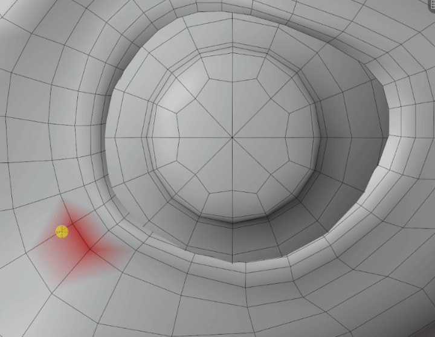

Paint, Blur, and Smear can edit color at the current Multires sculpt resolution. RGBA grids are saved with the active color attribute; changing levels retains the highest painted detail, and lower-level strokes update that detail. Undo/redo and saving/reopening preserve the grids. Applying Multires produces a regular color attribute on the evaluated mesh.

Brush updates and undo are restricted to the affected grids and their boundaries, and color storage is committed at stroke completion to keep painting responsive. This implementation supports Float and Byte attributes on Point and Face Corner domains. Color Filter and Mask by Color remain unavailable with Multires. The classic Vertex Paint mode retains its existing behavior. See [usage, storage, and validation notes](doc/bmax/multires_color.md). Publishing this source update does not publish a new Windows download.

### Object Mode Separate and fast Fill Holes

Added to the source on October 7, 2026, in commit `47896472`. **Object > Separate** and the Object context menu expose **By Loose Parts** and **By Material** using the existing C++ operator. **Fill Holes** now works in Object Mode under **Object > Clean Up** and in the context menu, as well as **Mesh > Clean Up** in Edit Mode.

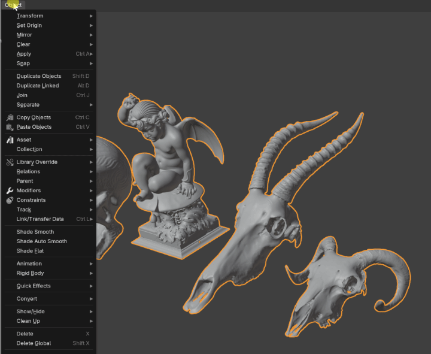

Fill Holes uses a native C++ fast path for simple boundary loops. Object Mode fills the selected mesh objects; Edit Mode respects selected edges. **Sides = 0** fills holes without a size limit and is the new default. Enable **New Face Sets** in **Adjust Last Operation (F9)** to give each newly filled patch a separate Sculpt Face Set while preserving existing IDs.

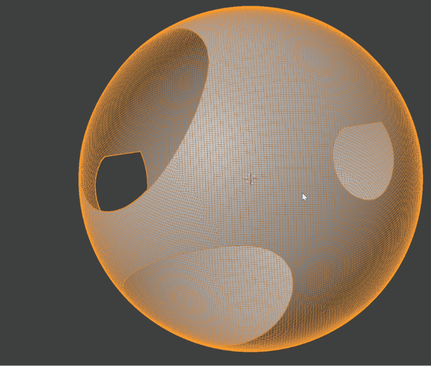

On the supplied 624,503-face scan, Object Mode Fill Holes with Face Sets took a median **0.337 s**, closing all 28 boundary loops. The Edit Mode operator took **0.203 s** with the mesh already in Edit Mode. These synchronous background timings exclude interactive undo and redraw. See [implementation and validation notes](doc/bmax/object_mesh_tools.md). The local runtime has been updated; the separately copied Desktop package and public Windows download have not.

### Mesh Data normal weighting

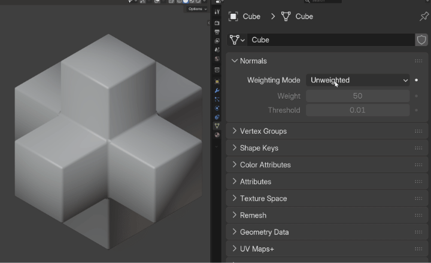

**Object Data Properties > Normals** offers **Unweighted** (the existing Blender automatic normals), **Face Area**, **Corner Angle**, and **Face Area & Angle**, with **Weight** and **Threshold** controls. Sharp edges and flat faces remain effective. Imported or manually edited custom normals take precedence; the Weighted Normal modifier can override the automatic result with its existing settings.

The setting is stored per mesh and does not bake automatic weights into custom normals. Official Blender can open the same `.blend` and uses its standard automatic shading when no custom normals or normal modifier is present. See [normal weighting notes](doc/bmax/mesh_normal_weighting.md) for compatibility and performance checks. The local runtime has been rebuilt and verified. The implementation is included in source commit `6f8c2738` on `main`; the separately copied Desktop packages and public Windows download have not been updated.

On the supplied scan, Face Area & Angle at Weight 50 took **6.84 ms** through Mesh Data versus **377.92 ms** with an active Weighted Normal modifier in Object Mode, and **34.00 ms** versus **417.49 ms** in Edit Mode. These medians measure geometry evaluation plus normal readback, excluding drawing and undo; unchanged cached reads are about 1 ms for both paths. See the notes above for methods and numerical differences.

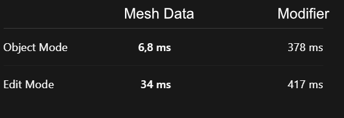

### Shared random colors for instances

Enable **Instances** in **Viewport Shading > Color** with **Random** selected for Object or Wireframe colors. Both modes share the checkbox, which defaults off.

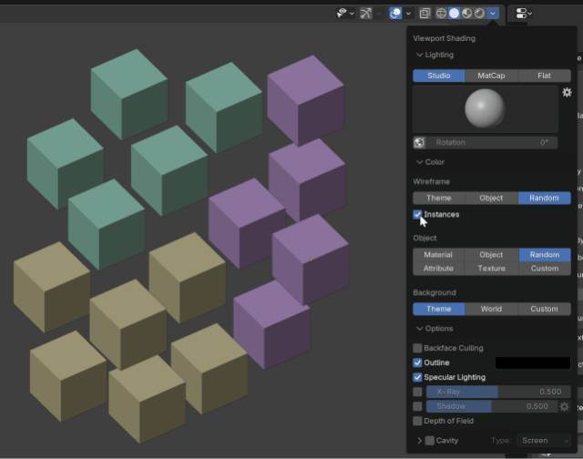

The **Object Info** shader node has an independent **Instances** checkbox affecting only its **Random** output in EEVEE and Cycles. Different nodes can use either behavior in the same material.

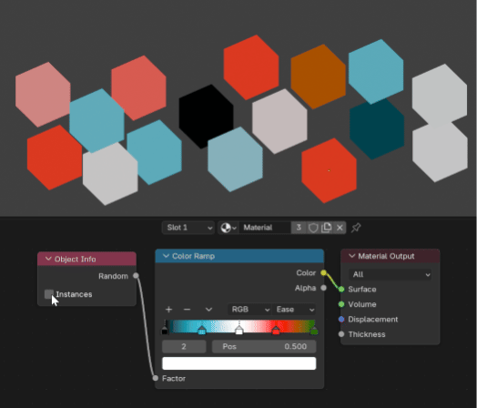

Alt+D linked duplicates, object/collection instances, and Geometry Nodes instances share a color/value by their geometry source, including generated and nested instances. **Realize Instances** ends this grouping. Generated prototype colors may change if their set or traversal order changes. See [controls, validation and timings](doc/bmax/instance_random.md).

The implementation is included in source commit `f68b422571e9` on `main`, and the local Windows runtime is updated. Separately copied Desktop packages and the public download have not been updated.

### Selected mesh openings

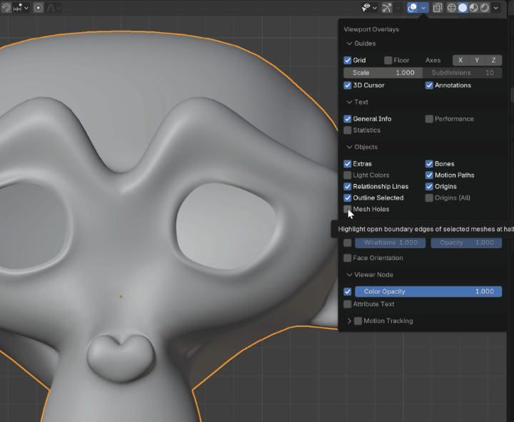

**3D Viewport > Overlays > Objects > Mesh Holes**, enabled by default, highlights open boundary edges of selected meshes in Object Mode. The line uses the selection color and half the theme's selection outline width, with a minimum of two physical pixels. Closed meshes and internal shared edges receive no extra lines. The option follows **Outline Selected**, the master Overlays toggle, X-Ray, and the object's In Front setting.

The boundary geometry is cached until the mesh changes and supports evaluated meshes and subdivision. See [the implementation and validation notes](doc/bmax/mesh_holes.md).

### Windows icon antialiasing and DPI sizes

Windows application and blend-file icons retain the Bmax logo with antialiased alpha edges. Small entries through 96 pixels now use 32-bit Windows bitmap payloads with alpha and a matching transparency mask; larger previews remain PNG. Sixteen sizes from 16 to 256 pixels include intermediate DPI sizes, avoiding rescaling a neighboring icon entry. See [icon implementation and validation](doc/bmax/windows_icons.md). This is included in the local runtime; separately copied Desktop packages and the public download require their own update.

### Absolute Octahedral Radius

Each bone has an **Octahedral Radius** control in **3D Viewport > N sidebar > Item**, available in Edit and Pose Mode. One absolute radius controls the octahedral body's half-width and both endpoint spheres, independently of rest-bone length. In Wire display, the Head and Tail spheres shown in Edit Mode use this same radius. The default for newly created bones is 0.02 Blender units (2 cm with standard metric units). In Pose Mode, evaluated pose scaling and shear remain visible, including nonuniform scaling.

In Octahedral display, the body now has a flat square base at the Head sphere boundary and tapers to the Tail sphere boundary. Head/Tail spheres retain their size, position, and selection behavior. Bendy Bones shown in Octahedral keep connected segment bodies with no intermediate spheres; only the two outer endpoints are trimmed. Bodies fully covered by overlapping endpoint spheres are omitted. The B-Bone box display type is unchanged. This body-shape update is included in source commit `2e4febbdb1df` and in the verified local runtime. Separately copied Desktop packages and the public Windows download require their own update.

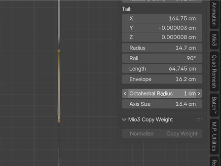

### Independent Axis Size

**Axis Size** appears directly below Octahedral Radius. It controls the display axes independently of bone radius and length. The default is **0.03 Blender units**, or **3 cm** with standard metric units. The object's scale still affects viewport display. Enabled bone axes always draw in front of scene geometry and other bones, even when the armature's In Front setting is off.

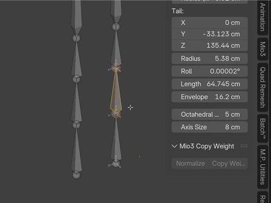

### Default new bone length

New armatures and **Add Bone** in Edit Mode start with a bone length of **20 cm**: `0.2` Blender units with standard metric units, adjusted for the scene's unit scale. Explicit operator lengths and radii are respected. Existing bones, duplicates, and extrusions keep their existing lengths and behavior; armature object scale still applies.

### New armature and bone display defaults

New armature objects use **Octahedral**, **In Front**, and object **Wire** display. Newly created bones default to Octahedral independently of the armature display type. **Add Bone** also enables In Front and Wire on the existing armature object. Existing bones retain their per-bone display settings; duplicates and extrusions retain their source settings.

Mesh Holes and its tooltip are translated into Japanese, Italian, French, and Spanish. This viewport polishing is included in source commit `5f6eba240126` and in the verified local runtime. Separately copied Desktop packages and the public Windows download require their own update.

### Default new bone rotation mode

New bones use **XYZ Euler** rotation by default, including new armatures and bones added in Edit Mode or through Python. Resetting Rotation Mode to its default also selects XYZ Euler. Existing bones keep their rotation modes; duplicates retain the source bone's mode.

### Active endpoint in Outliner range selection

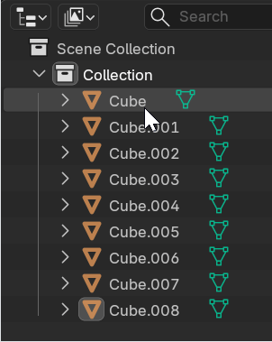

Shift-click activates the clicked endpoint after selecting an Outliner range. The selected range remains synchronized with the viewport; Ctrl+Shift can add the range to the existing selection. Subsequent Shift-clicks use the new active endpoint as their starting point. The local runtime in `D:\blender_build\octahedral_radius\bin` is updated and verified in nine GUI operator cases. Implementation commit: `87036d985cd3`, included in `main`. Separately copied Desktop packages and public Windows downloads have not been updated.

### Selection outlines for coincident elements

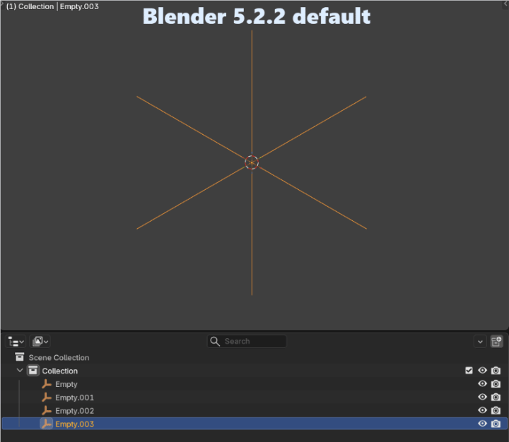

When armature elements coincide at the same depth, unselected elements are drawn first, selected elements next, and the selected active element last. This prevents a later unselected bone from replacing the selection outline and gives the active bone priority among coincident selected bones. The ordering applies to Pose and Edit Mode and selected armature objects. Existing depth tests, X-Ray/In Front behavior, and picking remain in place. Selected mesh objects also retain their outlines when coincident with unselected meshes. Empty shapes and image frames, legacy curves, lattices, and meshes made only of loose edges or points use the same selection priority in Object Mode. Their wires are grouped by selection across these overlay types, so creation order does not hide the selected color.

### Names and axes for selected bones

The armature's **Names** and **Axes** toggles display these overlays only for selected bones. In Edit Mode, selecting a head or tail also qualifies the bone. Existing master toggles still enable or disable each overlay.

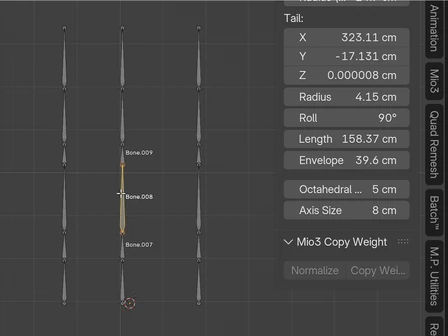

### Hide/unhide synchronization

Bone hide state transfers between Pose and Edit Mode when switching modes. Hidden bones are deselected during transfer. Bone collection visibility remains a separate visibility filter.

### Origin axes during transforms

With **Options > Affect Only > Origins** enabled, the origin axes default to **0.2 Blender units** (20 cm with standard metric units).

Uniform scaling remains visible while dragging. On confirmation, the axes return to their previous display lengths, retaining any differences between axes. Scaling an individual axis remains visible after confirmation: for example, scaling X by 2 changes its displayed length from 20 cm to 40 cm while Y and Z remain at 20 cm. Cancelling a transform restores the previous display. This adjustment is specific to the Affect Only Origins axes; the standard Object > Viewport Display > Axes display retains its existing behavior.

The uniform-scale compensation is stored per object in the `.blend` file.

### Modifier defaults

New **Weighted Normal** modifiers use **Face Area & Angle** with **Keep Sharp** enabled. New **Triangulate** modifiers have **Keep Normals** enabled. New **Displace** modifiers use **Strength = 0.1**. These defaults apply when adding modifiers; saved modifier settings remain unchanged.

### UV shell outlines and diagnostics

In **UV Editor > Overlays > Geometry**, three controls help inspect visible UVs in both **Object Mode and Edit Mode**. In Object Mode they inspect the selected mesh objects:

- **Shell Outline** draws a white outline **2 physical pixels inward** along each UV shell boundary, including holes. Its width stays constant when zooming, and internal UV edges are excluded.
- **Overlap** highlights the intersecting area of overlapping UV faces in red, including partial intersections and overlaps between objects. **Opacity** controls the opacity from 0 to 1; its default is **0.5 (50%)**, and 1 gives solid red.
- **Flipped UVs** highlights UV faces with reversed orientation in magenta, with its own **Opacity** slider defaulting to **0.5 (50%)**.

**Faces** has a separate **Opacity** slider, also defaulting to **0.5 (50%)**. It controls the face fill independently of UV line opacity. All three fill opacity controls work in Object and Edit Mode.

When both diagnostics are enabled, red takes priority in overlapping areas. In Object Mode, UV lines are drawn after the face and diagnostic fills so Flipped and Overlap do not cover the lines. Object Mode lines use the chosen UV line opacity without the automatic quarter-strength fading of modifier/paint guides. White shell outlines appear above the diagnostics. The main Overlays toggle hides these UV diagnostics. Both modes use the same Geometry panel, diagnostic flags, fill opacities, UV line opacity, and face visibility settings. Changing a control in either mode is reflected when switching to the other. Diagnostics use the original UV map, so modifiers that repeat geometry do not create false UV overlaps.

#### Partial UV overlap

The overlap color updates while UV shells move; only the intersecting area turns red. These demonstrations also show the inward shell outlines.

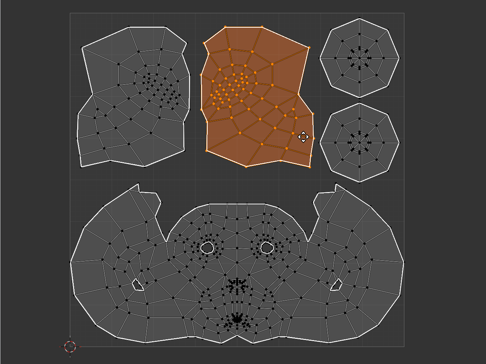

#### Flipped UVs

Mirroring a UV shell immediately marks its reversed orientation in magenta.

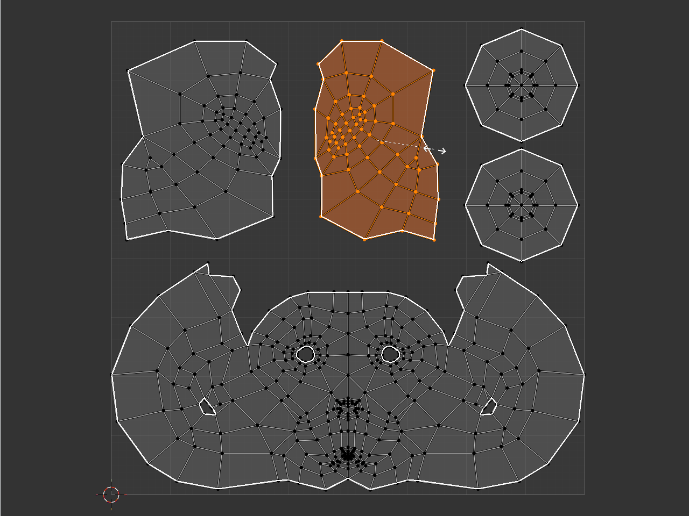

### UV background opacity and stable framing

**UV Editor > Overlays > Image > Opacity** controls the background image's opacity independently of the UVs. At 0 the image is transparent; at 1 it is fully visible. This setting remains effective when the main Overlays toggle is off.

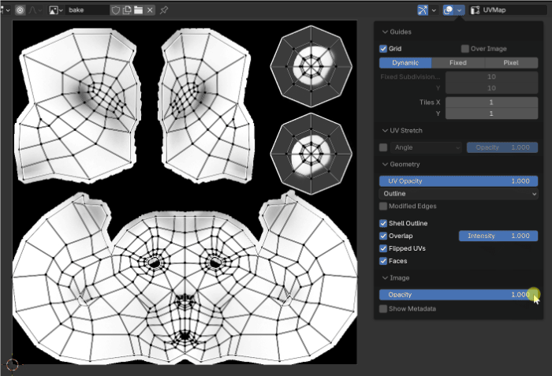

Adding, removing, or switching the background image preserves the UVs' size and position on screen, including switches between 512-pixel and 4K images or images with different aspect ratios. Automatic image changes from the active material also preserve the view. Pan and zoom continue to work after an image change.

### Branding and Windows executable

Bmax includes a custom splash logo and Windows icons, Bmax window titles and command-line version output, and a separate Bmax Windows application identity. The executable is named **blender.exe**. It uses the existing Blender 5.2 preferences and startup configuration.

## File compatibility

Bmax uses Blender's `.blend` format. Its custom Octahedral Radius, Axis Size, origin-axis uniform-scale compensation, UV diagnostic settings, background opacity, and UV view aspect are stored in Bmax files. Files lacking the UV diagnostic settings open with those flags disabled and missing fill opacities set to 0.5; missing background-image opacity defaults to 1. Saved opacity values are retained. Explicit zero values survive saving and reopening. Official Blender does not expose the Bmax-specific properties and may discard them when re-saving a file. Standard rigging and animation data continue to use Blender's existing structures.

Mesh Data normal weighting is saved per mesh; official Blender ignores the extra settings and uses its standard automatic normals, while preserving ordinary custom normals and modifiers. Re-saving there discards the Bmax weighting choice. Multires paint grids require Bmax: apply Multires in Bmax to transfer a finished painted mesh as a regular color attribute. See the [normal weighting](doc/bmax/mesh_normal_weighting.md) and [Multires color](doc/bmax/multires_color.md) notes for details.

## Build and source

This repository publishes a source snapshot based on Blender **v5.2.2**, upstream commit **d13f752e3b9c4f8c261cda552b1021f8bcc0382c**, plus the Bmax changes. It does not include Blender's complete upstream Git history. `main` is the stable development and build branch. The retired `codex/armature-ui` and `codex/bmax-publication` branches are preserved by the tags `archive/armature-ui-2026-10-05` and `archive/bmax-publication-2026-10-05`. New changes can use temporary feature branches before integration into `main`.

Use [Blender's Windows build instructions](https://developer.blender.org/docs/handbook/building_blender/windows/). Git LFS is required: `.lfsconfig` downloads inherited assets from Blender's public LFS server and routes LFS uploads to MaxPuliero/Bmax on GitHub. Bmax-owned artwork and the animated demonstrations are stored directly in this repository. Dependency submodules retain their upstream Blender URLs. Precompiled libraries and local build output are not committed.

The Windows Release build has compiled successfully using Visual Studio 2022 / MSVC v143. The current local build omits precompiled CUDA, HIP, and oneAPI kernels. This publication contains source code rather than a packaged Windows binary.

See [Building Bmax on Windows](doc/bmax/BUILD_WINDOWS.md) for the verified local paths, Release build and installation commands, and an inline startup check. On 2026-10-06, source commit `6a2340f5a1dd` on `main` compiled and installed successfully. The installed build passed Manifold Boolean, XYZ Euler and 50% UV fill default checks, plus Box/Lasso/Polyline/Line Trim on closed meshes without Multires in OpenGL and Vulkan. Runtime and standalone bug-report links were verified to target Bmax GitHub issues. Bmax development tests have been removed; inherited Blender tests remain, with test targets disabled in the local build. Temporary verification files and logs are kept outside the source repository and removed afterward.

Origin axes were checked in 19 viewport captures on both OpenGL and Vulkan, including old-file migration, 20 cm defaults, uniform scaling during the modal gesture and after confirmation, per-axis scaling, cancellation, negative uniform scaling, Undo/Redo, and save/reload in a new session. The object geometry retained its world-space position throughout the origin transforms.

Object Mode UV diagnostics were additionally checked in 15 cases on each backend, including holes, UV seams, hidden faces, partial overlap, flipped UVs, and the 2-pixel outline at two zoom levels. Ten captures per backend verified shared panel availability, repeated mode switches, settings and framing preservation, changes made in either mode, the main Overlays toggle, and original UV diagnostics with Array modifiers.

The UV changes were checked in the running editor on both OpenGL and Vulkan: 15 diagnostic cases, including the exact 2-pixel outline at two zoom levels, and 21 background/view cases covering 4K images, rectangular images, removal, automatic image changes, pan, zoom, opacity, and save/reload. Image switches produced no change in the measured UV screen coordinates. Old-file migration and persistence were also verified.

The armature demonstrations are animated WebP files resized to **35%** of their original dimensions (448 × 336), retaining frame timing and looping. The normal weighting, Fill Holes, Separate, Mesh Holes, selection priority, and Multires painting demonstrations are animated WebP files encoded losslessly, retaining their original 720-pixel width, height, total duration, frame timing, and looping; identical consecutive frames can be combined. The instance viewport, Object Info, and Outliner selection demonstrations use the original animated GIFs at their native dimensions, preserving frame timing and looping. The UV demonstrations use the original animated GIFs, preserving their frame timing, resolution, and looping. The overlap and flipped-UV GIFs are displayed at 448 pixels wide; the image-opacity GIF is displayed at its original 700-pixel width to keep the controls readable.

## License and attribution

Bmax is derived from Blender, developed by the Blender Foundation and its contributors. Blender is licensed under the **GNU General Public License, version 3**; see [COPYING](COPYING) and the existing source-file notices for applicable terms. Bundled third-party components retain their respective licenses.

This is an independent custom build. See the [original Blender README](doc/bmax/README_BLENDER_UPSTREAM.md) for upstream project links.
